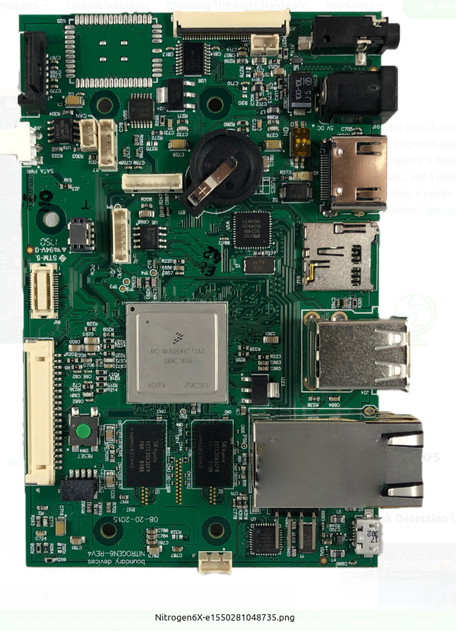

# Nitro_UbuntuBase
Build instructions, custom files for building UbuntuBase on Nitrogen6x

The Nitrogen6X is an Embedded single board computer (SBC) based on the
NXP i.MX6 applications processor.

I used this board at Black Diamond Advanced Tech to prototype running
tcp/ip data over the USB channel.    The data was mostly video, but
some audio too.

Check out the file 'notes_usb_tcpip.txt'

----------

